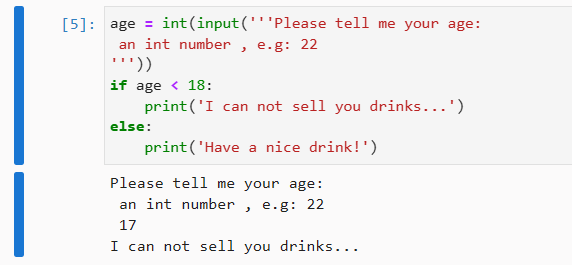

# 5.5 字符串


## 1 字符串的四种表示法

标识一个字符串的方式有四种：

- 单引号
- 双引号
- 三个单引号
- 三个双引号


单个字符转编码值：`ord('a')`（`ord` 即 `ordinal`，表示序数）

编码值转单个字符：`chr(97)`（`chr` 即 `character`，表示字符）


## 2 input 函数

`Python` 的内建函数 `input()` 用于接收用户的键盘输入，然后将其作为字符串返回。因此输入的内容不可直接与数字比较大小，需要先用 `int()` 等函数进行转换：

```python
age = int(input('''Please tell me your age: 
 an int number , e.g: 22
'''))
if age < 18:
    print('I can not sell you drinks...')
else:
    print('Have a nice drink!')
```

运行结果：


输入 `17` 并按回车确认后：




> [!tip]
>
> `Python` 中的 `input()` 函数类似 `Visual Basic` 中的 `InputBox()` 函数、`JavaScript` 中的 `window.prompt()` 函数。


## 3 关于转义符

转义符（Escaping Character）本身不作为字符使用，主要用于书写字符串中的特殊字符，如 `\n`、`\r\n`。

其中的 `n` 表示 `new-line`；`r` 表示 `carriage return`，即回车。

```python
ord('\n') # 10
ord('\t') # 9
ord('\r') # 13
chr(65)   # 'A'
```


> [!tip]
>
> **苹果电脑又叫 Macintosh 的原因**
>
> （from `Kimi`）：苹果电脑之所以被称为 `Macintosh`，是因为其项目发起人 **Jef Raskin** 根据他最喜欢的苹果品种 `McIntosh` 来命名的。为了避免与一家音响制造商 `McIntosh` 的公司名称重复，他将名称稍作修改，改为 `Macintosh`。
> 在英语中，`Macintosh` 这个词还有其他含义。它最初是由苏格兰化学家 **Charles Macintosh** 发明的一种防水材料，因此这种材料制成的雨衣也被称为 “`mackintosh`” 或简写为 “`mac`”。此外，“`Mac`” 在英语中也可以用作对陌生男子的称呼，意为 “伙计，老兄”。


## 4 字符串的索引操作符

`Python` 中的索引操作符即 `[]`。其中可以有一个、两个或三个整数参数。多个参数间用 `:` 分隔。共有以下五种表示方法：

- `s[index]` —— 返回索引值为 `index` 的那个字符
- `s[start:]` —— 返回从索引值为 `start` 开始一直到字符串末尾的所有字符
- `s[start:stop]` —— 返回从索引值为 `start` 开始一直到索引值为 `stop` 的那个字符*之前*的所有字符
- `s[:stop]` —— 返回从字符串开头一直到索引值为 `stop` 的那个字符*之前*的所有字符
- `s[start:stop:step]` —— 返回从索引值为 `start` 开始一直到索引值为 `stop` 的那个字符*之前*的，以 `step` 为步长提取的所有字符

```python
from IPython.core.interactiveshell import InteractiveShell
InteractiveShell.ast_node_interactivity = "all"

s = 'Python'
s[1]     # 'y'
s[2:]    # 'thon'
s[2:5]   # 'tho'
s[:5]    # 'Pytho'
s[1:5:2] # 'yh'
```

求字符 `char` 在字符串 `s` 中的索引，使用：`s.index(char)`

利用 **索引** 来提取字符串这个 **有序容器** 的一个或多个元素，这个操作有个专门的术语，叫 **切片（Slicing）**。